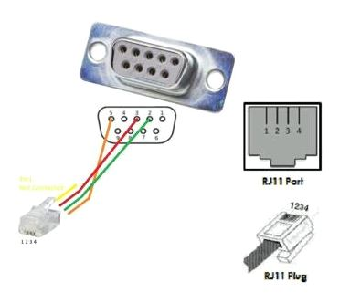

# ioBroker.pylontech

**Tests:** 

## pylontech adapter for ioBroker

Query the cell voltages and the status of pylontech batteries via the console. I'm not affiliated.

**Please note that everything you build or connect is always your responsibility. The developer of this adapter assumes no liability for any damage!**

## how it works

This adapter is used to determine the health status and functions of a Pylontech array, which can consist of one or up to fifteen batteries.
This adapter is not used to control the battery. This is the part of a charging and power unit or an inverter.
The batteries have a console connection that provides a RS232 or V24 interface. This adapter is connected to it via a serial interface.
The first battery provides all the data and asks the others via the uplink.
Attention, it is not possible to connect a Raspberry or ESP directly. The RS232 interfaces do not have a TTL level and are not designed for 3 volts or 5 volts. A level converter is required for connection. You will find construction instructions below.

## What is needed for connection?

A cable and a serial converter are required for connection.
A serial connection requires three lines rxd, txd and ground.

Rxd and Txd must be crossed. so that what one sends (Txd) can be received (Rxd) by the other. Ground is needed so that a voltage can be built up and an electrical current can be started.

### The serial connection cable

Pylontech has changed the RJ plugs on the batteries over time.
In the beginning there were was a RJ11 plugs like on the telephone. Now it is an RJ45 like on the network connection.
The following drawings show a standard nine pin D-SUB female connector on the cable.
This cable can be easily connected via the USB port with a RS232 to USB adapter.
Only the first battery in the array provides all information. You only need a cable and a serial port

#### RJ45

RJ45 | signal  | DSUB | signal
-----|--|--|---
8 | Ground | 5 | Ground
3 | TxD | 2 | RxD
6 | RxD | 3 | TxD

#### RJ11 / RJ12
The RJ11 and RJ12 connectors are the same size. The RJ11 has only four contacts, the RJ12 has six contacts. The contacts of the RJ11 are in the middle of the plug, which is why they are counted differently. Physically the contacts are in the same place.

RJ11 | RJ12 | signal  | DSUB | signal
---|--|--|--|---
1 or 4 | 2 or 5 | Ground | 5 | Ground
3 | 4 | TxD | 2 | RxD
2 | 3 | RxD | 3 | TxD

There are RJ45 console cables with USB port for Cisco routers. These do not have a compatible occupancy. However, with a little experience the RJ45 plug can be replaced.

Please note that due to the relatively high transfer rate for RS232 connections of 115200 baud, the cable cannot be particularly long.

| max. baud   | max. length |
| ----------- | ----------- |
| 2400        | 900m        |
| 4800        | 300m        |
| 9600        | 152m        |
| 19.200      | 15m         |
| 57.600      | 5m          |
| **115.200** | **2m**      |

If there is no USB port nearby, you can build a serial to WiFi adapter with an ESP.

These adapters speak a kind of Telnet and essentially extend the serial interface through the WiFi. Here it is important to install a driver module for the serial interface. E.g. the MAX3232. Please pay attention to the voltages but most of them are 3V.

#### ESP MAX

<Image assignment RJ45>

Since the Raspberry also offers a TTL interface with 3V, you can also connect a MAX3232 here.

#### Raspi MAX

[]

read more http://www.savagehomeautomation.com/projects/raspberry-pi-rs232-serial-interface-options-revisit.html

<Image assignment RJ10>

Anyway, you can also contact me in the ioBroker forum via PM if you need anything.

Another tip: there are cheap and expensive USB serial converters. Converters with CHxxx PLxxx and CPxxx in the name have no identifying features. If you connect two of them and then swap the ports or boot for the first time, you no longer know who is who. Therefore it is better to take the good ones with FTDI and serial number. There are also good serial converters without an FTDI chip that have a serial number.

### Connection

Only the first Accu in the array provides all information. If you connect this adapter to one of the following accus, it will no longer work because this accu cannot answer all requests.

## Admin interface

## Values and operations

## Changelog

<!--
    Placeholder for the next version (at the beginning of the line):
    ### **WORK IN PROGRESS**
-->

### **WORK IN PROGRESS**

- (PLCHome) initial release

## License

MIT License

Copyright (c) 2023 PLCHome

Permission is hereby granted, free of charge, to any person obtaining a copy
of this software and associated documentation files (the "Software"), to deal
in the Software without restriction, including without limitation the rights
to use, copy, modify, merge, publish, distribute, sublicense, and/or sell
copies of the Software, and to permit persons to whom the Software is
furnished to do so, subject to the following conditions:

The above copyright notice and this permission notice shall be included in all
copies or substantial portions of the Software.

THE SOFTWARE IS PROVIDED "AS IS", WITHOUT WARRANTY OF ANY KIND, EXPRESS OR
IMPLIED, INCLUDING BUT NOT LIMITED TO THE WARRANTIES OF MERCHANTABILITY,
FITNESS FOR A PARTICULAR PURPOSE AND NONINFRINGEMENT. IN NO EVENT SHALL THE
AUTHORS OR COPYRIGHT HOLDERS BE LIABLE FOR ANY CLAIM, DAMAGES OR OTHER
LIABILITY, WHETHER IN AN ACTION OF CONTRACT, TORT OR OTHERWISE, ARISING FROM,
OUT OF OR IN CONNECTION WITH THE SOFTWARE OR THE USE OR OTHER DEALINGS IN THE
SOFTWARE.
